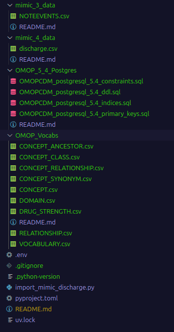

# TRExt Workshop DB Setup

## Prerequisites

Please ensure either MIMIC-III or MIMIC-IV licensed data is downloaded, these datasets can be found here:

- <https://physionet.org/content/mimic-iv-note/2.2/>
- <https://physionet.org/content/mimiciii/1.4/>

Additionally, a small selection of Athena vocab files should be downloaded. It isn't currently confirmed which ones we should use, so pick some such as SNOMED and MeSH for a good start.

Athena vocab files: <https://athena.ohdsi.org/search-terms/start>

## Setup

### Required software

- PostgreSQL
- Python >= 3.8

### Data file placement

Store your OMOP CDM 5.4 postgresql creation scripts inside the OMOP_5_4_Postgres folder.

Store your MIMIC-4 (discharge.csv) or MIMIC-3 (NOTEEVENTS.csv) data in the mimic_4_data or mimic_3_data folders respectively.

Store your Athena vocab files inside the OMOP_Vocabs folder.

Once completed, your file structure should look similar to this:



### Python environment

Python uv was used in this project, however all dependencies can be installed using alternative package managers.

```bash
# create virtual environment
uv venv

# activate the venv
source .venv/bin/activate

# sync dependencies
uv sync
```

### Running

Run the import python script whilst providing either 3 or 4 for the desired MIMIC version.
MIMIC-III Import

```Python
python import_mimic_discharge.py 3
```

MIMIC-IV Import

```Python
python import_mimic_discharge.py 4
```
